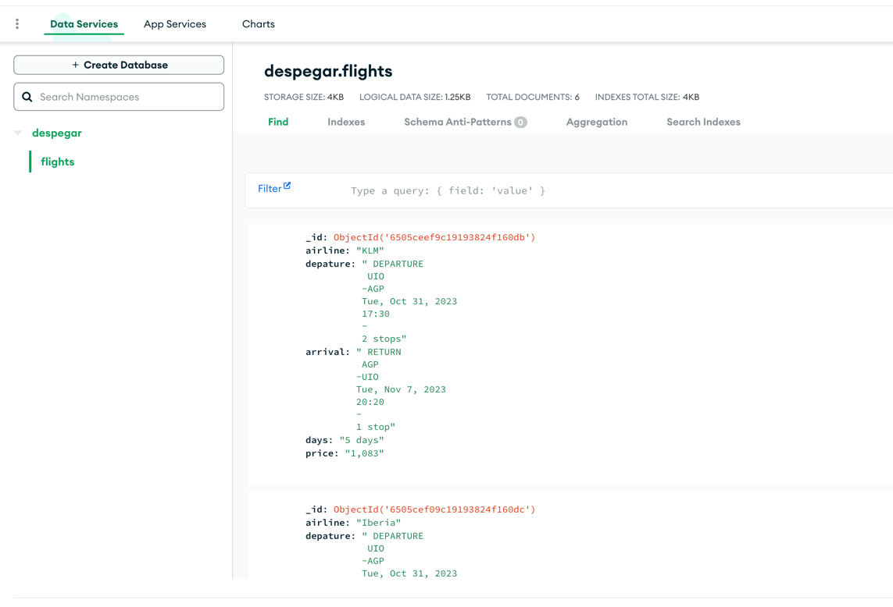

# scraper-despegar.com
Selenium scraper for despegar.com

### Step 1:

Create a file for environment variables: `.env`

```commandline

MONGO_USER=username # replace with yours
MONGO_PASSWORD=password # replace with yours
MONGO_HOST=cluster0.patata.mongodb.net # replace with yours
```
### Step 2:

Install libraries 

```commandline
pip install -r requirements
```

### Step 3

Run `main.py`

```commandline
python3 main.py
```

## Step 4

Check mongo results

